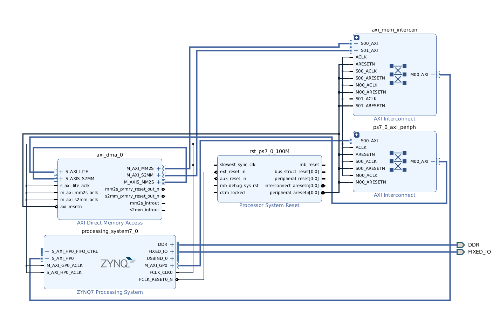
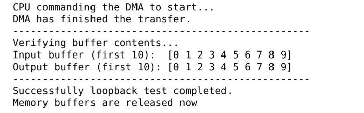

# Zynq PS-PL AXI DMA Memory Test on PYNQ-Z2

[](https://opensource.org/licenses/MIT)
[](./)
[](./)

A hardware/software co-design project demonstrating high-bandwidth data transfer on a Zynq-7000 SoC. An AXI DMA core in the Programmable Logic (PL) moves data to and from off-chip DDR3 memory, with the entire process initiated and verified by Python running on the ARM Processing System (PS).

This project showcases a fundamental workflow in modern SoC development: using pre-existing, professional-grade IP cores to build and verify complex systems.

<div align="center"></div><br>

* **Processing System (PS):** The ARM Cortex-A9 processor runs a Linux OS and the PYNQ framework. It is responsible for orchestrating the entire test.
* **Programmable Logic (PL):**
    * **AXI DMA Controller:** This IP is the core of the PL design, configured to handle memory-mapped to AXI-stream transfers (and vice-versa).
    * **AXI Interconnects:** These IPs route the AXI traffic between the PS, the DMA controller, and the high-performance AXI ports connected to the DDR memory controller.

## Verification Workflow

The project is verified using a hardware-in-the-loop approach with a Jupyter Notebook running on the PYNQ board.

1.  **Hardware Generation (Vivado):** The Vivado project is built using a `Makefile` and Tcl scripts. The output is a bitstream (`.bit`) and a hardware handoff file (`.hwh`).
2.  **Software Verification (Jupyter):**
    * The `.bit` and `.hwh` files are copied to the PYNQ board.
    * A Jupyter Notebook (`software/AXI_DMA.ipynb`) allocates memory buffers and configures the DMA.
    * It initiates a DMA transfer and then compares the source and destination buffers to verify data integrity, printing "Successful loop back test".

## How to Run

This project uses a `Makefile` to automate all common tasks. All commands must be run from the root directory of the repository.

### Prerequisites
* Xilinx Vivado Design Suite (e.g., 2024.1 or later)
* `make` build automation tool

### Instructions

1.  **Clone the Repository:**
    ```shell
    git clone git@github.com:Sreeram-Ramesh/zynq-axi-dma-test.git
    cd zynq-axi-dma-test
    ```

2.  **Build the Vivado Project & Generate Bitstream:**
    This command generates a fresh Vivado project in the `build/` directory and runs synthesis and implementation.
    ```shell
    make
    ```

3.  **Deploy to PYNQ:**
    This command copies the necessary bitstream and hardware handoff files into a `deploy/` folder, ready to be transferred to your PYNQ board.
    ```shell
    make deploy
    ```

4.  **Clean the Project:**
    This command completely removes the generated `build/` and `deploy/` directories.
    ```shell
    make clean
    ```

### Running on your PYNQ-Z2 board

1.  **Deploy Files to the Board:**
    * Connect to your PYNQ board.
    * Copy the `.bit`, `.hwh`, and `.ipynb` files to the Jupyter home directory on the board.

2.  **Run the Jupyter Notebook:**
    * Open a web browser and navigate to your PYNQ board's Jupyter Notebooks interface (e.g., `http://pynq:9090` or alternately IP address `192.168.2.99`).
    * Open the `dma_test.ipynb` notebook.
    * Execute the cells in order by selecting `Cell > Run All` from the menu.

3.  **Verify the Outcome:**
    * The notebook will load the hardware overlay, allocate memory, and perform the DMA transfer.
    * Upon completion, it will give you the following output message.

<div align="center"></div><br>

---